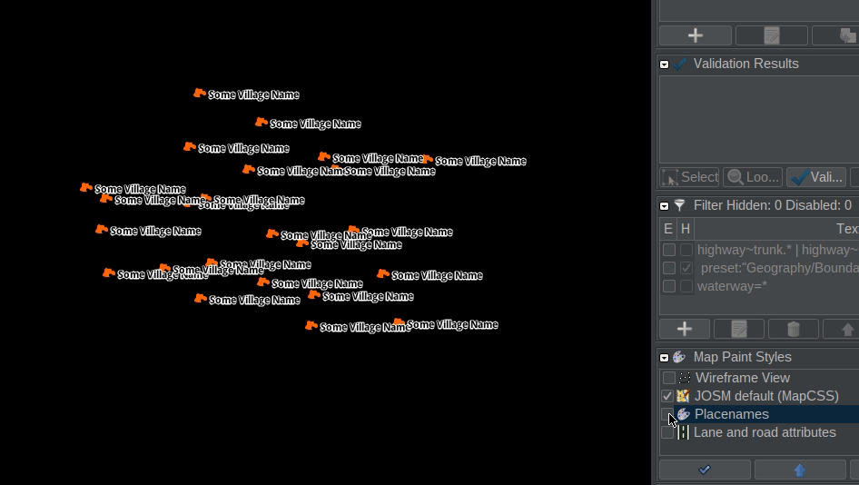

# Styles!

JOSM styles are super useful. Some help visualize attributes, some help with validation. This directory is for the random styles I make as I work on different projects.

If any of these get developed fully, then I will move them into their own repo, but most of these don't rise to that level.

# noplacenames

Someone on Discord asked: Can I just remove the labels from place nodes? *Yes!*

# extra-things

There are a bunch of tags that aren't in the "standard" JOSM set, but I consider useful. Like `natural=shrubbery`!